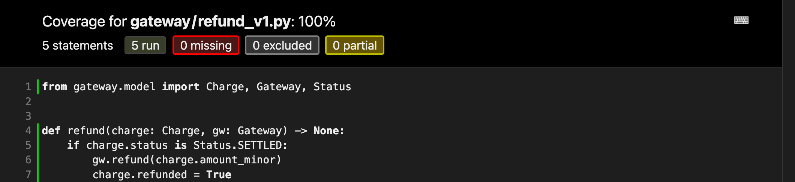
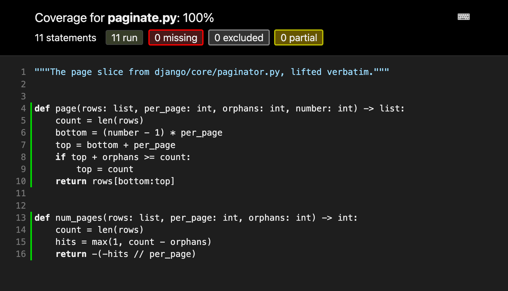

#+TITLE: LGTM Is Not a Theorem
#+AUTHOR: Durwasa Chakraborty
#+STARTUP: showeverything
#+EPRESENT_FRAME_LEVEL: 1

# The same deck as deck.html, for epresent.  Run it with ./epresent.sh.
#
# One slide per top-level heading.  Extra markup, drawn by deck-present.el:
#   #+pause:            everything below this line is the next build step
#   {{{bad(text)}}}     colour a span: dim faint accent good bad warn violet
#                       punch punchbad punchem sub subtitle
#                       pill pillgood pillbad pillon
#   {{{at(N)}}}         continue at column N; lines sharing stops line up
#   text  «bad»         a trailing tag colours the whole line (works inside
#                       example blocks without breaking their alignment)
# Per-slide properties:
#   :SCALE:       text-scale step for a crowded slide, e.g. -1
#   :IMG_HEIGHT:  largest share of the window height an image may take
#   :HEADING:     heading size multiplier;  :NORULE: t drops the accent rule
# Screenshots with an img/NAME-light.png twin swap automatically in light mode.

#+MACRO: dim $1
#+MACRO: faint $1
#+MACRO: accent $1
#+MACRO: good $1
#+MACRO: bad $1
#+MACRO: warn $1
#+MACRO: violet $1
#+MACRO: punch $1
#+MACRO: punchbad $1
#+MACRO: punchem $1
#+MACRO: sub $1
#+MACRO: subtitle $1
#+MACRO: pill $1
#+MACRO: pillgood $1
#+MACRO: pillbad $1
#+MACRO: pillon $1
#+MACRO: at  

* LGTM Is Not a Theorem
:PROPERTIES:
:HEADING: 1.45
:NORULE: t
:END:

{{{subtitle(Pragmatic Verification And The Economics Of Software Confidence)}}}

*Durwasa Chakraborty*  {{{faint((he/him))}}}
PhD :: Formal Verification & Programming Languages, IIT Madras  «dim»
MS :: Northeastern University, Boston MA  «dim»
BE :: Government Engineering College, Jabalpur MP  «dim»
Previously IBM (Kolkata, WB) $\cdot$ MathWorks (Natick, MA) $\cdot$ AWS (Seattle, WA)  «faint»

INDIAFOSS 2026  «faint»

* Refunds. Tuesday.
:PROPERTIES:
:IMG_HEIGHT: 0.36
:END:

{{{pill(AUTHORIZED)}}}{{{at(18)}}}→{{{at(26)}}}{{{pill(CAPTURED)}}}{{{at(42)}}}→{{{at(50)}}}{{{pillon(SETTLED)}}}
held on the card{{{at(26)}}}taken from them{{{at(50)}}}money in our account  «faint»

capture → settlement is =T+1=. Today we only refund what has settled.

{{{pillgood(2 passed)}}}  {{{pillgood(100%)}}}  {{{pillgood(0 missing)}}}  {{{pillgood(0 partial)}}}

* Wednesday: the same-day cancellation

Settlement lags capture by a day, so a customer who cancels that afternoon is *CAPTURED*, not *SETTLED*, and support cannot refund them.

#+begin_src python
    if charge.status is Status.SETTLED:
        gw.refund(charge.amount_minor)
        charge.refunded = True
    elif charge.status is Status.CAPTURED:      # the ticket
        gw.refund(charge.amount_minor)
        charge.refunded = True
#+end_src

{{{pillbad(75% · missing 9-10)}}}
#+pause:
{{{pillgood(copy the test · change one word → 100%)}}}

* Copy the test. Change one word.
:PROPERTIES:
:SCALE: -1
:END:

the test that already exists  «faint»
#+begin_src python
def test_refunds_a_settled_charge():
    c = Charge(1, Status.SETTLED, 24900)
    gw = Gateway()
    refund(c, gw)
    assert gw.refunds == [24900]
#+end_src
{{{faint(the one you)}}} {{{accent(paste under it)}}}
#+begin_src python
def test_refunds_a_{{{warn(captured)}}}_charge():
    c = Charge(3, Status.{{{warn(CAPTURED)}}}, 24900)
    gw = Gateway()
    refund(c, gw)
    assert gw.refunds == [24900]
#+end_src
#+pause:
{{{pillgood(3 passed)}}}  {{{pillgood(100%)}}}  {{{pillgood(0 missing)}}}  {{{pillgood(0 partial)}}}
#+pause:
Nine seconds of work. The build is green. /Ship it./

* Thursday, 02:14. {{{dim(Sev-2.)}}}

The gateway call for a refund times out. The job *retries* it. Nothing in =refund()= remembers that the first one already went through.
#+pause:
#+begin_example
[SEV-2] refunds: duplicate payouts in prod  «bad»
refund(charge 3)   gw.refund(24900)   ok    timeout
refund(charge 3)   gw.refund(24900)   ok    ← retry
gw.refunds: [24900, 24900]   refunded twice  «bad»
#+end_example
#+pause:
{{{pillbad(49800 out on a 24900 charge)}}}  {{{pillbad(every retried refund pays twice)}}}
{{{pillgood(coverage: still 100%)}}}
#+pause:
We are losing money. /Patch it tonight./

* So you patch it
:PROPERTIES:
:SCALE: -1
:END:

the guard  «faint»
#+begin_src python
def refund(charge, gw) -> None:
    if charge.refunded:      # the patch
        return
    if charge.status in REFUNDABLE:
        gw.refund(charge.amount_minor)
        charge.refunded = True
#+end_src
{{{faint(and the test for it)}}}  {{{accent(82% → 100%)}}}
#+begin_src python
def test_refunding_twice_refunds_once():
    c = Charge(4, Status.SETTLED, 24900)
    gw = Gateway()
    refund(c, gw)
    refund(c, gw)
    assert gw.refunds == [24900]
#+end_src
#+pause:
{{{pillgood(4 passed)}}}  {{{pillgood(100%)}}}  {{{pillgood(0 missing)}}}  {{{pillgood(0 partial)}}}
#+pause:
#+begin_example
gw.refunds: [24900]   retry is a no-op  «good»
#+end_example
#+pause:
Idempotent now. Incident closed. /Properly fixed./

* More testing… {{{dim(more testing…)}}} {{{faint(more testing…)}}}
:PROPERTIES:
:IMG_HEIGHT: 0.74
:END:

#+pause:
{{{punchbad(Testing will not catch this one.)}}}

* Two ways in. The same broken state.
:PROPERTIES:
:SCALE: -1
:END:

one worker, {{{accent(a timeout)}}}
#+begin_example
who     step                  (r, p)  «faint»
A       read flag → false     (false, 0)
A       gw.refund()           (false, 1)  «warn»
A       504, exception        raises  «faint»
A       refunded = True       never runs  «faint»
retry   read flag → false     (false, 1)
retry   gw.refund()           (false, 2)  «bad»
#+end_example
two workers, {{{accent(no failure at all)}}}
#+begin_example
who     step                  (r, p)  «faint»
A       read flag → false     (false, 0)
B       read flag → false     (false, 0)
A       gw.refund()           (false, 1)  «warn»
B       gw.refund()           (false, 2)  «bad»
A       refunded = True       (true, 2)  «faint»
B       refunded = True       (true, 2)  «faint»
#+end_example
#+pause:
Both pass through =(false, 1)=, money gone, flag still down. /The guard reads the flag, so it waves both of them through./

* Then stop guessing the schedule

A test has to pick an interleaving, and there are exponentially many. So pick none. Instead prove that *every single step* keeps one sentence true.

#+begin_quote
\[ \mathrm{Agree}(r, p) \;\equiv\; p \le 1 \;\land\; (r = \mathsf{false} \Rightarrow p = 0) \]
{{{sub(the flag and the money agree)}}}
#+end_quote
#+pause:
If it holds at the start, and no step can break it, it holds in /every reachable state/, under every interleaving, including the ones you never thought of.

* A trace you found. An obligation you cannot discharge.

\[
\begin{array}{@{}l@{\qquad}l@{}}
\cfaint{\textsf{assume}} & \mathrm{Agree}(\mathsf{false}, 0) \\
\cfaint{\textsf{step}}   & t_2 : p \mathrel{+}= 1 \qquad \cdim{\text{(\texttt{gw.refund} returns)}} \\
\cfaint{\textsf{show}}   & \mathrm{Agree}(\mathsf{false}, 1) \\[10pt]
                          & 1 \le 1 \qquad \cgood{\checkmark} \\
                          & r = \mathsf{false} \Rightarrow p = 0
                            \quad \cdim{\text{becomes}} \quad 1 = 0
                            \qquad \cbad{\times\ \text{unprovable}}
\end{array}
\]
#+pause:
/The goal itself hands you the bug, and every other route to it you never imagined./

* The same step, written twice
:PROPERTIES:
:SCALE: -1
:END:

what is proved  «violet»
#+begin_src lean
def cas (s : St) : St :=
  if s.refunded then s
  else ⟨true, s.payouts + 1⟩

theorem cas_preserves : Agree s → Agree (cas s)
theorem cas_safe (n : Nat) : Safe (run n ⟨false, 0⟩)
#+end_src
what ships  «accent»
#+begin_src python
claimed = (Charge.objects
    .filter(id=cid, refunded=False)
    .update(refunded=True))
if claimed == 0:
    raise AlreadyRefunded
gw.refund(charge.amount_minor)
#+end_src
#+pause:
One SQL statement is one atomic step, so the model has one too. Read the flag and write it in the same move, and =(false, 1)= stops being reachable, /for any number of workers, in any order./

* So why don’t we prove everything?

If the mathematics is this good, why are any of us still writing tests?
#+pause:

{{{punch(Well… because…)}}}
#+pause:

#+begin_quote
software has economics
{{{sub(you spend something, you get something, and it has to pay for itself)}}}
#+end_quote

* If it goes through, it is a proof

#+pause:
And if the proof goes through on your machine, it /is/ a proof. Not probably. Not mostly. The checker does not care who wrote it, or whether they understood it.
#+pause:

That is not true of generated code. Generated code needs a reviewer. A generated proof arrives already reviewed, by a program that cannot be talked round.
#+pause:

#+begin_quote
it proves the statement you gave it
{{{sub(whether that statement says the right thing is still yours)}}}
#+end_quote

* The curve moved

The steep part used to be *producing* the proof. That is what took years to learn, and it is the part you now hand over.
#+pause:

What is left is not easier. It is different.
#+pause:

#+begin_quote
coming up with the theorem
reading the statement
deciding whether it is enough
#+end_quote
#+pause:

{{{punch(The skill is not writing the proof.)}}}\(\cfaint{\raisebox{0.9ex}{\Large$\ast$}}\)
#+pause:

\(\cfaint{{}^{\ast}\,\text{\footnotesize at scale, proof size and token cost matter again. This is about the first step.}}\)

* You have shipped this a hundred times

REFUNDS  «faint»
| rfnd_8821 | acc_42 |   249.00 | {{{good(settled)}}} |
| rfnd_8822 | acc_17 |   899.00 | {{{good(settled)}}} |
| rfnd_8823 | acc_91 |   120.00 | {{{good(settled)}}} |
| rfnd_8824 | acc_08 | 1,499.00 | {{{good(settled)}}} |
| rfnd_8825 | acc_63 |    75.00 | {{{good(settled)}}} |
{{{pillon(1)}}}  2  3  4  5  ›        {{{faint(23 refunds · 5 per page)}}}
#+pause:

Twenty-three rows, five to a page. Something has to decide /which rows land on which page/, and that something is a handful of lines in Django.

* A very small chunk of Django
:PROPERTIES:
:IMG_HEIGHT: 0.72
:END:

The code that decides which rows land on which page, and the suite that covers it.

* It is arithmetic. What could go wrong?

Fair. I mutated those lines nine ways: off-by-ones, flipped comparisons, a dropped =orphans=. Every one was caught. *The suite is good.*
#+pause:

Then I read the rest of the file:
#+pause:
#+begin_src python
if self.per_page <= self.orphans:
    # RemovedInDjango70Warning: ... replace with:
    # raise ValueError(
    #     "The orphans argument cannot be larger than or "
    #     "equal to the per_page argument."
    # )
#+end_src
#+pause:

{{{punchbad(Django shipped that for years before anyone wrote the precondition down.)}}}

* One line, and what it buys
:PROPERTIES:
:SCALE: -1
:END:

{{{faint(before)}}} {{{accent(Django 7.0)}}}
#+begin_src python
Paginator(rows, per_page=2, orphans=20)   # 22 rows → 1 page of 22
#+end_src
{{{faint(from)}}} {{{accent(Django 7.0)}}}
#+begin_src python
Paginator(rows, per_page=2, orphans=20)   # ValueError: orphans cannot be
                                          # larger than or equal to per_page
#+end_src
#+begin_src lean
theorem page_bounded (hk : 0 < k) {{{warn((ho : o < k))}}} (l : List α) :
  ∀ p ∈ pages k o hk l, p.length < 2 * k
#+end_src
#+begin_example
$ lake build
  Build completed successfully  «good»
#+end_example
#+pause:
{{{faint(delete)}}} =(ho : o < k)= {{{faint(and build again)}}}
#+begin_example
$ lake build
  error: omega could not prove the goal  «bad»
  a possible counterexample may satisfy  «faint»
    a ≥ 1   a + b - c ≥ 0   2*a - c ≤ 0
  where  a := k   b := o   c := p.length  «faint»
#+end_example

* I am not asking you to prove everything

Not your views. Not your templates. Not your ORM. Not the two million lines you inherited and cannot change.
#+pause:

#+begin_quote
start at the boundary
{{{sub(where your state meets something you do not control)}}}
#+end_quote
#+pause:

A gateway that retries. A client that parses your JSON. A queue that delivers twice. That is where the contract lives, and it is /small./

* And you do not have to start with a proof

Every property on the last few slides can be checked without proving anything at all.

#+begin_src python
@given(st.lists(st.integers()), st.integers(min_value=1))
def test_pages_partition(rows, per_page):
    assert flatten(paginate(rows, per_page)) == rows
#+end_src
#+pause:

{{{pillgood(property-based testing)}}}  {{{pillgood(fuzzing)}}}  {{{pill(pip install hypothesis)}}}
#+pause:

They make you /write the contract down./ They do not make you discharge it. Most of the value, a fraction of the price, and you can do it this afternoon.

* And it is not a silver bullet

A proof guarantees one thing: the code matches the spec.
#+pause:

#+begin_quote
this was never about certainty
{{{sub(it is about how much confidence you can afford)}}}
#+end_quote
#+pause:

{{{punch(All I am saying is that the price moved, and the economics are now)}}} {{{punchem(on your side.)}}}

* Thank you

/LGTM is a vote. A theorem is a receipt./

{{{faint(email)}}}      {{{accent(durwasa.chakraborty@gmail.com)}}}  {{{good(preferred)}}}
{{{faint(blog)}}}       durwasa-chakraborty.github.io
{{{faint(github)}}}     github.com/durwasa-chakraborty
{{{faint(bluesky)}}}    durwasa.bsky.social
{{{faint(linkedin)}}}   in/durwasa-chakraborty
#+pause:

Special thanks to *Anirudh Gupta*, IISc Bangalore for verifying within boundaries and
*Prof. KC Sivaramakrishnan and Prof. Kartik Nagar* for PBT and fuzzing and ... well everything about Formal Verification.

#+pause:

Every tool in this talk is free software.  «faint»
Python · coverage.py · Hypothesis · Lean 4 · Django  «faint»
